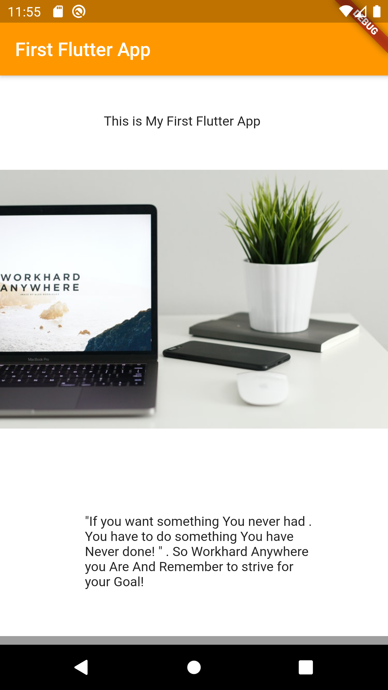
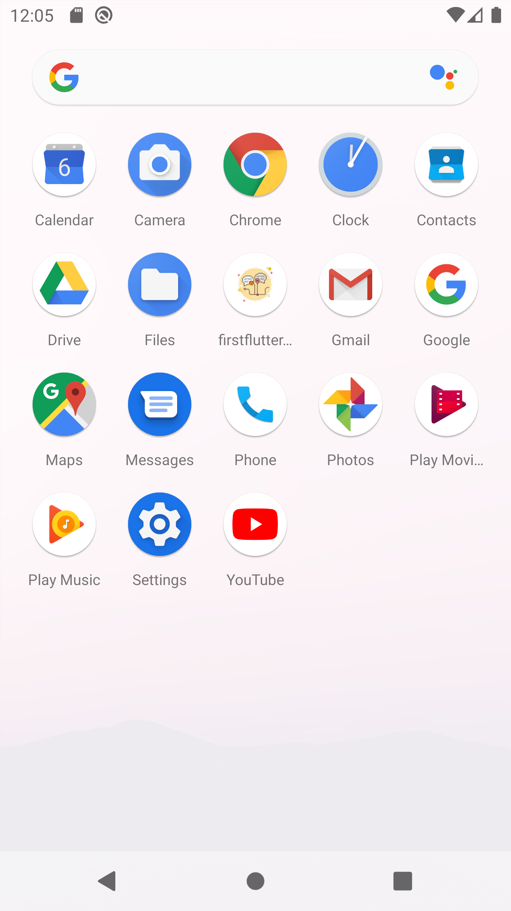

# FirstFlutterApp

My First Flutter application.

## Getting Started

- This project is a starting point for a Flutter application with basic widgets.
- This App is built with a scaffold,Column and Container.
- It Also has a App Icon.

# Display Mode

  
